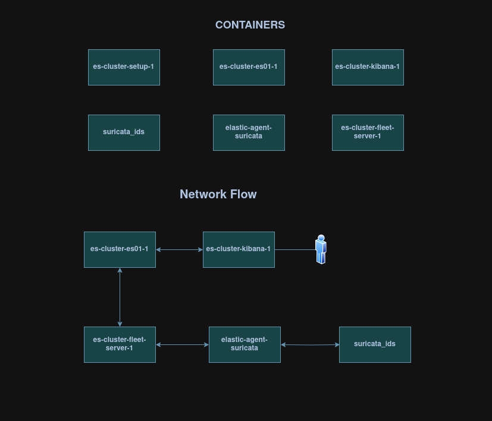
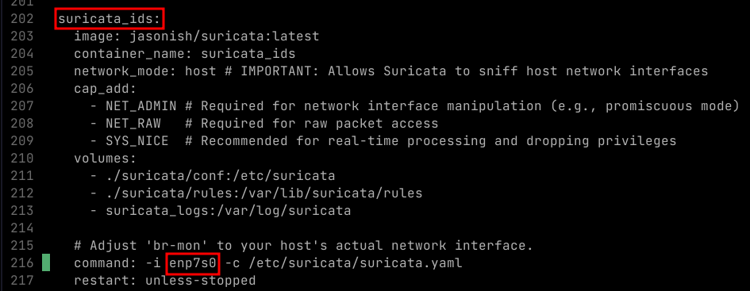
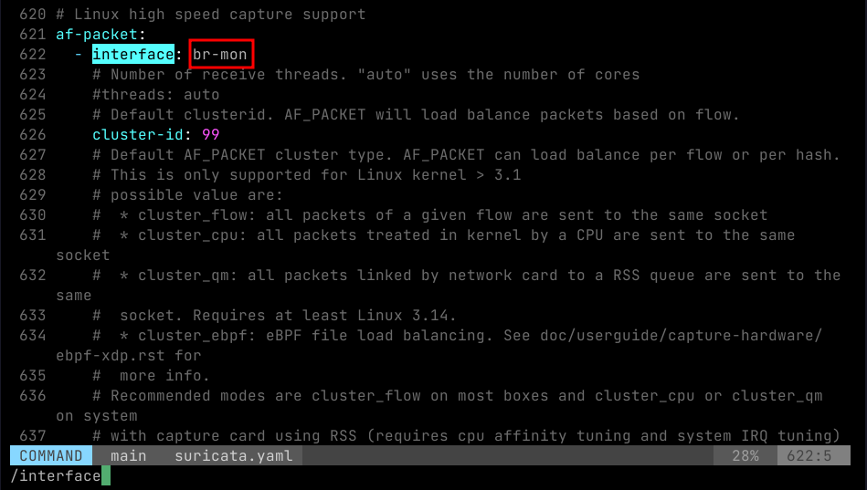

# Setting up ELK Stack with Suricata: A Customized Docker-Compose Deployment

This document details the deployment and configuration of an Elastic (ELK) Stack integrated with Suricata, built upon a customized docker-compose.yml derived from the `elkninja/elastic-stack-docker-part-two project`. This fork aims to provide a streamlined solution for network intrusion detection (NIDS) and log analysis, leveraging Docker for ease of deployment and management.





## Config Changes

__Change Interface in `suricata.yaml`, `docker-compose.yml`__
- Use the *same interface* in both the configs.

`docker-compose.yml`



`suricata/conf/suricata.yaml`



__Add `suricata` integration to `elastic-agent`__
- You can only do this change after elastic and kibana are set up and running.
- Change `FLEET_ENROLLMENT_TOKEN` & `FLEET_SERVER_POLICY_ID` (maybe optional) for **elastic-agent-suricata** in `docker-compose.yml`
- And run this:

```bash
docker compose up -d
```

---
## Installing

```bash
docker compose up -d
```

---
## Suricata update
- After docker compose and everything is running healthy, you can do this.
```bash
docker exec -it --user suricata suricata_ids suricata-update -f
```

---
## Create suricata policy from cli

> This needs running kibana and elastic containers

- Create a policy with name: 'suricata-policy-1'
- Outputs it's enrollment token. Use this token in `.env` for `SURICATA_ENROLLMENT_TOKEN` value.
- Add suricata integration to this policy from kibana.


```bash
./create-suricata-policy.sh
```

```txt
Policy ID: af93d264-798c-48a2-ab4c-a28fbe28d990
Token: VmEzbWJKY0J2YjVxZGszbmRvTDA6OHI3allxdnowWXBkYUl5QVJnOEhyQQ==
```

>To Do: Integrate suricata to the policy in the script

---

## Start elk-server on boot

> Modify according to your needs.

- Script to start `elk-server`

`/home/elk/start-elk.server`
```bash
#!/usr/bin/bash

cd ~/ELK-Suricata-Docker

docker compose up -d
```
- Script to start `elk-server` on startup

`/etc/systemd/system/start-elk.service`
```bash
[Unit]
Description=Start ELK Stack
After=network.target docker.service
Requires=docker.service

[Service]
Type=simple
ExecStart=/home/elk/start-elk.server
User=elk
WorkingDirectory=/home/elk/ELK-Suricata-Docker
Restart=on-failure

[Install]
WantedBy=multi-user.target
```

- Register the service

```bash
sudo systemctl daemon-reexec
sudo systemctl daemon-reload
sudo systemctl enable start-elk.service
```

---
## Trouble Shooting
### Rest elastic user password

- If for some reason you cannot login with the password you configured in `.env`

```bash
docker exec -it es-cluster-es01-1 bash
```

```bash
./bin/elasticsearch-reset-password -u elastic --url https://localhost:9200
```

```bash
docker compose down && docker compose up -d
```


> You also need to change the password in `.env` to the one generated.

## Suricata elastic agent exiting

- Sometimes, it won't get booted properly, in that case, just restart and analyze the logs and the kibana.

```bash
docker compose start elastic-agent-suricata
```

```bash
docker compose logs elastic-agent-suricata
```

## Interfaces down in VM

- In my setup, running this on ubuntu server, I found few interfaces are not `UP` when booting - which is causing suricata_ids and related containers are not healthy.

```bash
ls /etc/netplan/
```

```bash
sudo vim /etc/netplan/50-cloud-init.yaml
```

- enp1s0 - my NAT to host
- enp7s0 - for suricata (port mirroring in pfsense)
- enp8s0 - pfSense interface

```txt
network:
  version: 2
  ethernets:
    enp1s0:
      dhcp4: true
    enp7s0:
      dhcp4: false
    enp8s0:
      dhcp4: true
```

- First try the config

```bash
sudo netplan try
```

- After checking with `ip addr`
- You can apply changes

```bash
sudo netplan apply
```

### Hard-rest

- Clears all data in cluster as well

```bash
docker compose down --volumes
```

```bash
docker compose up --build -d
```

### Check logs for any trouble shooting

```bash
docker logs <container-name>
```

---

| Container                  | ID                        |
| -------------------------- | ------------------------- |
| Fleet Server               | es-cluster-fleet-server-1 |
| Elastic Search             | es-cluster-es01-1         |
| Kibana                     | es-cluster-kibana-1       |
| Suricata                   | suricata_ids              |
| Elastic Agent for Suricata | elastic-agent-suricata    |
| Certificate Generator      | es-cluster-setup-1        |
